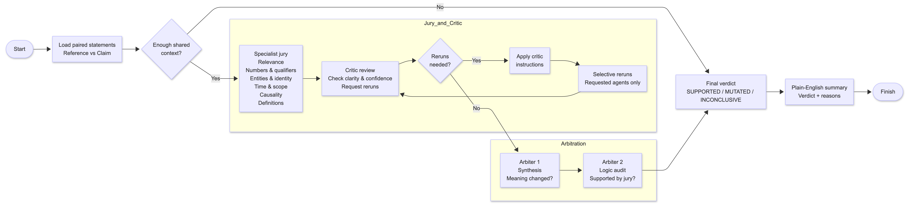

# FACTTRACE – AI Truth Jury



FACTTRACE evaluates whether a **system-generated claim** faithfully preserves the meaning of a **reference (ground) truth**.

Instead of asking “is this true?”, FACTTRACE decomposes truthfulness into **independent semantic dimensions** and evaluates each using specialised AI jury agents, followed by a **deterministic (non-LLM) arbitration layer**. This makes the decision process transparent, auditable, and resistant to single-model hallucination or overconfidence.

The output is a clear verdict:
- **FAITHFUL** – meaning preserved  
- **MUTATED** – meaning changed  
- **AMBIGUOUS** – insufficient context or unresolved logical disagreement  

Won second place in FACTTRACE cambridge hackathon. 

---

## How it works (high level)

1. **Context sufficiency gate**  
   Determines whether the reference truth contains enough information to judge the claim at all.  
   If not, the process stops early with an **AMBIGUOUS** verdict and explicitly lists what information is missing.

2. **Specialist jury checks**  
   Independent agents assess the claim against the reference across key dimensions:
   - Relevance / topic alignment  
   - Numbers and units  
   - Entities and identities  
   - Timeframes and qualifiers  
   - Causality and inference  
   - Definitions and terminology  

3. **Arbiter #1 (rule-based)**  
   Applies a strict rule:
   - If *any* specialist fails → **MUTATED**  
   - If *all* specialists pass → **FAITHFUL**

4. **Arbiter #2 (logic audit)**  
   Audits Arbiter #1’s reasoning for internal consistency and rule-following.  
   If the reasoning is debatable or flawed, the final verdict is downgraded to **AMBIGUOUS**.

5. **Final summariser**  
   Produces a concise, human-readable verdict with a one-sentence reason and up to three key points.

All reasoning is surfaced step-by-step; there is no opaque “black box” judgement.

---

## Typical use cases

- Evaluating LLM outputs against source material  
- Detecting semantic drift in summaries or paraphrases  
- Auditing AI-assisted journalism or research synthesis  
- Building explainable AI evaluation pipelines  
- Demonstrating multi-agent governance patterns in AI systems  

---

## Requirements

- Python 3.10+  
- Conda (Miniconda or Anaconda)  
- OpenAI API key  

---

## Setup (Conda)

```bash
conda create -n facttrace python=3.11 -y
conda activate facttrace
pip install -r requirements.txt
